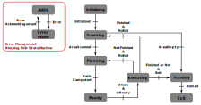

# Robetarme T5.3 - IRR - Control

## Table of Contents

- [Overview](#overview)
- [Submodule](#submodule)
- [Requirements](#requirements)
- [Docker](#docker)
  - [Build the Docker containers](#build-the-docker-containers)
- [Build code](#build-code)
- [Getting Started](#getting-started)
  - [Real scenario](#real-scenario)
  - [Simulation scenario](#simulation-scenario)
  - [Planner](#planner)
  - [Task](#task)
  - [Laser Service](#laser-service)
  - [UR Simulation](#ur-simulation)
    - [cb-series Polyscope](#cb-series-polyscope)
    - [e-series Polyscope](#e-series-polyscope)
  - [Toy Data](#toy-data)
- [VSCode support](#vscode-support)
- [Troubleshooting](#troubleshooting)
  - [X Server issues](#x-server-issues)
- [License](#license)
- [Credits](#credits)
- [Maintainers](#maintainers)

## Overview

The repository comprises multiple packages written in C++17. Currently, it is designed to work with ROS Noetic and MoveIt through docker containers.

There are two main FSM built for that project, as follow :

Error Handling FSM:

- **AllOk -** This state is here to claim that the robot is safe to use and there are no errors.
- **ErrorMode -**  Here an error occurs and needs to be acknowledged. It can be a safety error or simply an error in the execution of the task. After the error is acknowledged, it goes back to AllOk mode and the main FSM is resumed from where it was.

Main FSM:

- **Initializing -** This is where every objects are initialized. It creates an object for the MoveIt planning scene, it initializes the known static obstacles and so on.
- **Scanning -** This step does perform the scanning of the area to detect all the parts needing a repair. It uses the work of DTU and an intel realsense camera.
- **Planning -** Here is the planning for the subtask. It will extract a path from the different waypoints and save it for later use.
- **Ready -** As soon as the path is computed, the Robot enters in a Ready state where a Start signal is waiting to move to Executing state.
- **Executing -** The path is executed with welding or cleaning execution when needed. If the robot is asked to exit, then it goes to Homing state otherwise it goes back to Planning or Scanning, based on the task ongoing.
- **Homing -** The robot goes back to its initial position when the task is finished, it means it will just exit the FSM.
- **Exit -** Here the task is finished, the FSM exited and all the unnecessary Cpp objects destroyed.



## Submodule

This code is integrated as a submodule. To be cloned directly with the git, run:

```bash
git clone --recurse-submodule <git_repo_name>
```

If the git is cloned with the standard method you can always initialize and update the submodule running:

```bash
git submodule init
git submodule update
```

Then to manage a submodule, you have to think about a github repo inside an other one. The submodule is a github repo at a certain state. To update it you have to go inside the corresponding folder and update it as a normal github repository. And when you want to update the link to the latest state, you can push the changes from your root github repository as usual.

## Requirements

This code is supposed to run on Linux, tested on both Ubuntu 20.04 and 22.04. It uses docker, side to docker compose, with the nvidia toolkit if any nvidia graphics card is installed. So you need to install :

- [docker](https://docs.docker.com/engine/install/ubuntu/)
- [docker compose](https://docs.docker.com/compose/install/linux/#install-the-plugin-manually)

If you have an nvidia graphic card :

- [Nvidia Container Toolkit](https://docs.nvidia.com/datacenter/cloud-native/container-toolkit/latest/install-guide.html)

## Docker

Due to the nature of the project, docker is used to add portability and compatibility on different platforms.

### Build the Docker containers

The docker containers are using docker compose tools. It is located inside *docker/main_pkg* folder. There is a *docker-compose-common.yml* file containing the common part to be extended inside the other docker-compose files.

Then there is two different configuration files, with or without nvidia graphics integration. By default, in *docker-compose.yml* file, the nvidia graphics card is not taken into account.

To build the default configuration, do:

```bash
docker compose build
```

If you need a specific configuration, you have to specify which docker-compose file to use, using *-f* param as follow:

```bash
docker compose build -f <docker-compose-filename.yml>
```

Then you can set up the container, in detached mode, using :

```bash
docker compose up -d
```

And access it with a bash terminal, in interactive mode and specify the user to be, using :

```bash
docker exec -it --user <user_name> <container_name> bash
```

## Build code

Each CMakeLists.txt file is including the *common_config.cmake* file which contains the common part of the configuration and some help such as a **DEBUG_MODE** pre-processing variable definition to enable debugging part and safety in the code directly.

The code is automatically built when building the docker container, but if needed you can still build it inside the container, using:

```bash
catkin build
```

It is **HIGHLY** recommended to use the debug cmake flag when testing processes since it adds features like trajectory pre-vizualisation and user feedback before running any robot commands. It is automatically done using an environment variable, called **CMAKE_BUILD_TYPE** when set to *Debug*. You can still force the build using the following:

```bash
catkin build -DCMAKE_BUILD_TYPE=Debug
```

When in release and you want to disable the safety guards put, and enable the different code optimization *-O3* you can either set the environment variable to *Release* or build the code using:

```bash
catkin build -DCMAKE_BUILD_TYPE=Release
```

## Getting Started

When inside the container, see [docker](#docker) section, the code is launch using bash script files. Each of them is taking care about their dependencies and launch the corresponding roslaunch files.

For each of these files, default parameters are set inside the roslaunch file. If a specific parameter as to be set during the call, it is set inside the corresponding script. So for any modification, have a look inside both.

Here are the two main scenarios to be used. For more details on each parts, jump directly to [planner](#planner) and the next steps.

**For each run** double check the default parameters inside the files you run to ensure the correct behavior of the experiment.

### Real scenario

This scenario is using a real robot instead of the UR simulation tool. To do so, inside the docker container, run the following:

```bash
run_docker_planner.sh
run_docker_task_planning.sh
run_welding_laser_service.sh
```

Then, to start everything, run the following rosservice call:

```bash
rosservice call /ur10e/wp5_task_node/execution/enable "{}" # for the ur10e robot usage
rosservice call /ur5/wp5_task_node/execution/enable "{}" # for the ur5 robot usage
```

You can check the different possible calls to run, stop or kill the service, for example. They are directly visible when performing a rosservice list or looking at the implementation instructions from RobétArmé [gitlab](https://gitlab.com/certh-iti-robotics-lab/robetarme/robetarme-guides/-/tree/main/integration-templates/packages).

### Simulation scenario

You firstly have to run the UR simulation tools, there is docker for that. You can set it up running one of the following [UR simulation](#ur-simulation), depending on the robot.

Then follow with the [real scenario](#real-scenario).

### Planner

The planner is handled by Moveit! so the following run will set up a Moveit! instance with the robot in parameter, chosen in the following : [ur5, ur10e], by default it is set to ur10e.

To set up the code and wait for function call, run the following scripts in different terminals directly into the docker container:

```bash
run_docker_planner.sh
```

### Task

The task, wp5-mam-tasks ROS package in the code, is mainly implemented using the double FSM, based on Boost::MSM library. It will manage the calls to instantiate the following objects:

**Task -** Based on the task, by default it is a welding task.
**Planner -** Based on the instantiated task, by default it is a welding planner.
**Robotic Arm -** Based on the input parameter from the roslaunch, by default it is a UR10e robot.
**ObstacleManagement -** An object managing the Moveit! scene and all the obstacles to avoid during planning.

All of this will only run if the correct *taskType* parameter is set, currently it can be one of the following: [welding, cleaning], it is welding by default.

To set up the code, wait for a service call enabling all these instantiation and enable the TaskFSM, run the following script:

```bash
run_docker_task_welding.sh
```

### Laser Service

The welding laser management is done through a ROS service and can be launch using :

```bash
run_welding_laser_service.sh
```

### UR Simulation

If there is any need to run the UR simulation to have a fake robot in the setup, run one of the following, outside a docker, it will set one up:

```bash
run_ur_cb_sim.sh # for a cb-series UR robot (robot without e arg)
run_ur_e_sim.sh # for a e-series UR robot
```

#### cb-series Polyscope

When the tool is up and running, load the urcap file and run the simulator as soon as the planner is running. It will set up a connection between ROS and the polyscope, ur simulator.

For more details on running a given program, have a look at this [cb-series README](ur-package/docker/cb-series-docker/README.md).

#### e-series Polyscope

There is a high probability that the urcaps add-on is not installed when polyscope is up and running, first install it and restart the docker. When the tool is up and running again, load the urcap file and run the simulator as soon as the planner is running. It will set up a connection between ROS and the polyscope, ur simulator.

For more details on running a given program, have a look at this [e-series README](ur-package/docker/e-series-docker/README.md).

### Toy Data

Some toy data can be sent using a roslaunch file. It has to be done during the scanning phase of the robot, otherwise the robot will come back to its homing position.

The toy data are defined inside *catkin_ws/src/wp5-mam-tasks/config/waypoints.yaml*.

```bash
roslaunch wp5_mam_tasks publish_waypoints.launch
```

## VSCode support

If using vscode with remote control extension, you can attach a vscode window to the chosen container using the bottom left green button.

Doing so with the right configuration in .vscode folder you can enable debug with breakpoints in the IDE directly.

To do so, at least the *launch.json* file has to be set up correctly. Have a look to the json files inside *doc* folder. There is also a *tasks.json* file to be sure the code is built in debug mode when running the vscode debugger.

## Troubleshooting

### X Server issues

If no window showed up after setting up a docker image that should output one there may be an issue with the X server access. To allow docker using the X server, run the following command :

```bash
xhost +local:docker
```

## License

This project includes software licensed under the Apache License 2.0 and the BSD 3-Clause License.

See the LICENSE file and [Credits](#credits) section for more details for the overall project and ur-package/LICENSE file for the UR licensing part.

## Credits

This repository use the work of the following repositories:

- [Moveit!](https://github.com/moveit/moveit) - *BSD-3-Clause*
- [IK-Geo-Cpp](https://github.com/Verdant-Evolution/ik-geo-cpp)
- [ROS industrial](https://github.com/ros-industrial/universal_robot)
- [Universal Robot Driver](https://github.com/UniversalRobots/Universal_Robots_ROS_Driver) - *Apache 2.0*
- [ROS modbus device driver](https://github.com/epfl-lasa/ros-modbus-device-driver.git) - *MPL-2.0*

## Maintainers

- Louis Munier - <lmunier@protonmail.com>
- Last Update - 2025-01-26
