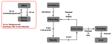

# Robetarme WP5 Deliverable

## Overview

The repository comprises multiple packages written in python first, for development purpose. Currently, it is designed to work with ROS Noetic and MoveIt, but plans are underway to transition it to ROS2.

There are two main FSM built for that project, as follow :

Error Handling FSM:

- **AllOk** This state is here to claim that the robot is safe to use and there are no errors.
- **ErrorMode**  Here an error occurs and needs to be acknowledged. It can be a safety error or simply an error in the execution of the task. After the error is acknowledged, it goes back to AllOk mode and the main FSM is resumed from where it was.

Main FSM:

- **Initializing** This is where every objects are initialized. It creates an object for the MoveIt planning scene, it initializes the known static obstacles and so on.
- **Planning** Here is the planning for the entire task. It will extract a path from the different waypoints and save it for later use.
- **Ready** As soon as the path is computed, the Robot enters in a Ready state where a Start signal is waiting to move to Executing state.
- **Executing** The path is executed with welding or cleaning execution when needed. If the robot is asked to exit, then it goes to Homing state otherwise it goes back to Planning.
- **Homing** The robot goes back to its initial position when the task is finished, it means it will just exit the FSM and be ready for another run when needed.
- **Exit** Here the task is finished, the FSM exited and all the unnecessary Cpp objects destroyed.



## Clone

This repository contains submodules :

```bash
git clone --recurse-submodules git@github.com:epfl-lasa/wp5-metal-additive.git
```

## Installation

We are currently using docker and its docker compose option. Please set it up before going forward.

The easy way is to run the setup.sh script which is in the root folder of this git repository, as follow:

```bash
bash setup.sh
```

It will setup everything using default values. All the environment variables needed in the docker are set up inside the .env file. You can modify them as you need.

To be more detailed, here are the needed commands to setup your git folder, to avoid sending too big files online. Then the commands update the submodules and finally build, mount and allow you to access docker container with the last docker commands.

```bash
# --- Submodules
# Initialize the submodules
git submodule update --init --recursive
git submodule update --recursive --remote

# --- Git Setup
# Copy pre-commit into hooks folder insside .git/hooks directory
cp "scripts/hooks/pre-commit" ".git/hooks/pre-commit"
chmod +x .git/hooks/pre-commit

# --- Docker
# Build the Docker containers
docker compose build

# Start the Docker containers in detached mode
docker compose up -d

# Access the Docker container's shell
docker exec -it wp5-metal-additive-ros-1 bash
```

This will set up the necessary environment within Docker for running the codebase.

## Maintainers

- Louis Munier - <lmunier@protonmail.com>
