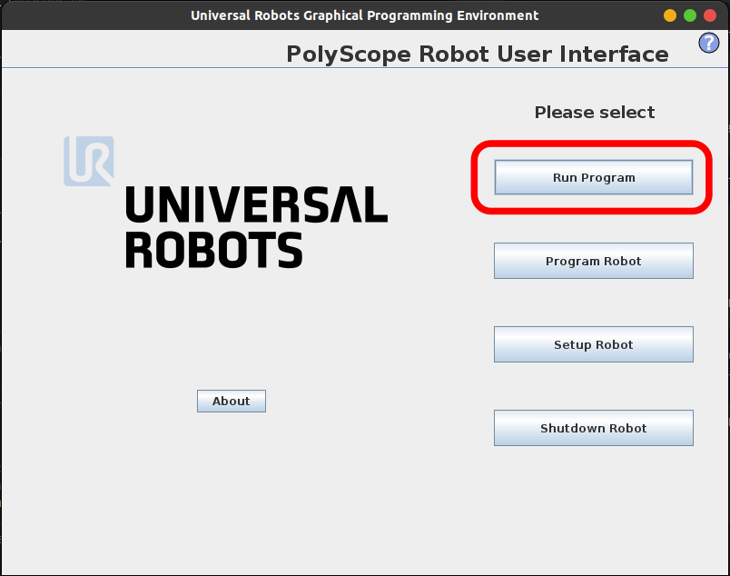
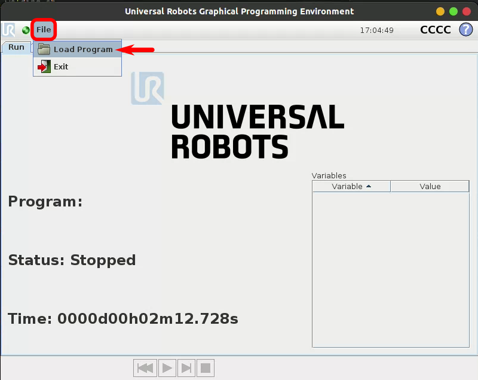
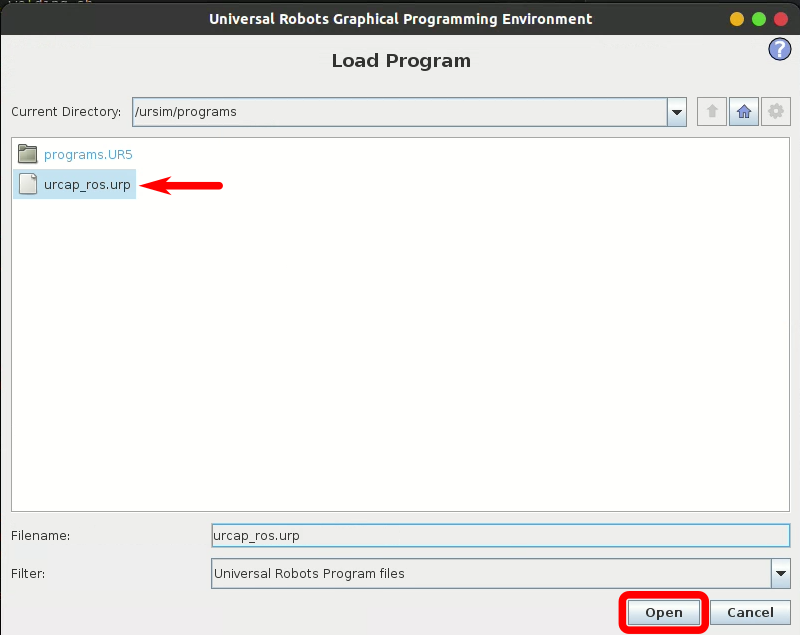
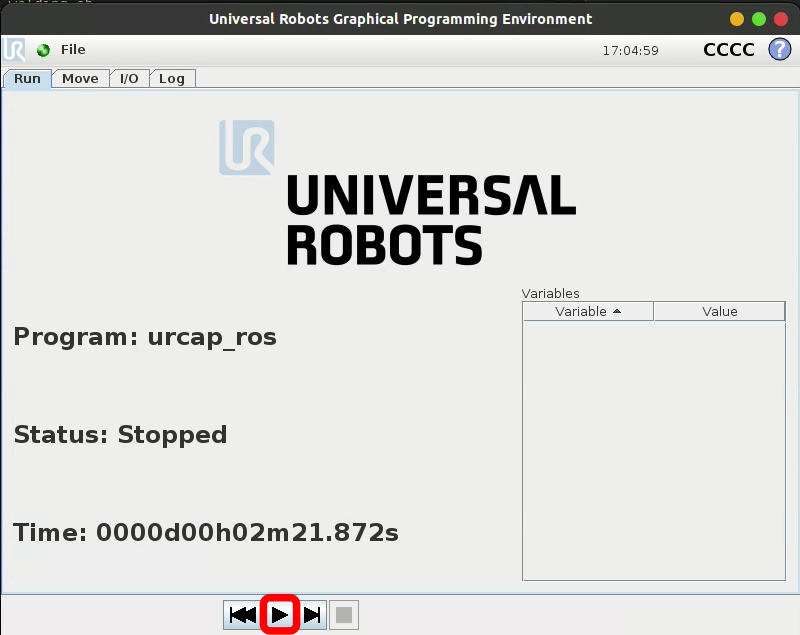

# UR Polyscope - cb-series

## Table of Contents

- [Overview](#overview)
- [Run a given program](#run-a-given-program)
- [Maintainers](#maintainers)

## Overview

This folder contains the docker to run the polyscope version 3.15 to deal with cb-series UR robotic arms.

## Run a given program

To load and run the file, click on *Run Program*:

Click on file -> Load Program:

Load the urcap file to establish the contact between the polyscope and ROS:

Click on the play button to enable the connection and have a simulation ready. It has to be stop / play again when the ROS node is restarted.

## Maintainers

- Louis Munier - <lmunier@protonmail.com>
- Last Update - 2025-01-26
