# UR Polyscope - e-series

## Table of Contents

- [Overview](#overview)
- [Run a given program](#run-a-given-program)
- [Maintainers](#maintainers)

## Overview

This folder contains the docker to run the polyscopeto deal with e-series UR robotic arms.

## Run a given program

To go to the settings, click on the hamburger menu on the top right then settings:

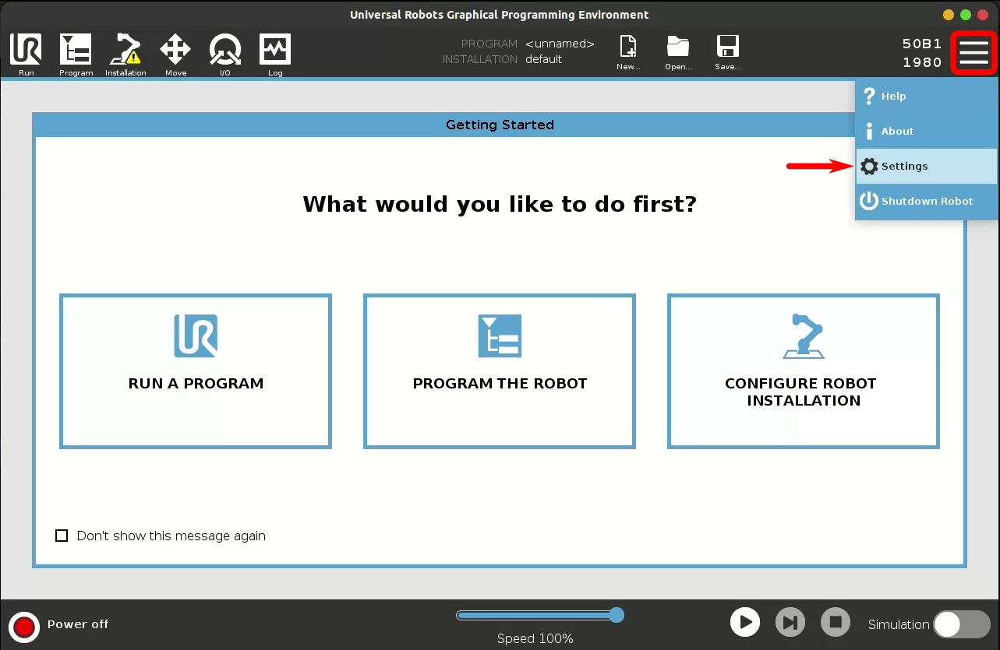

Verify if urcaps is loaded, under settings -> urcaps. If not, click on the *+* button on the bottom left:

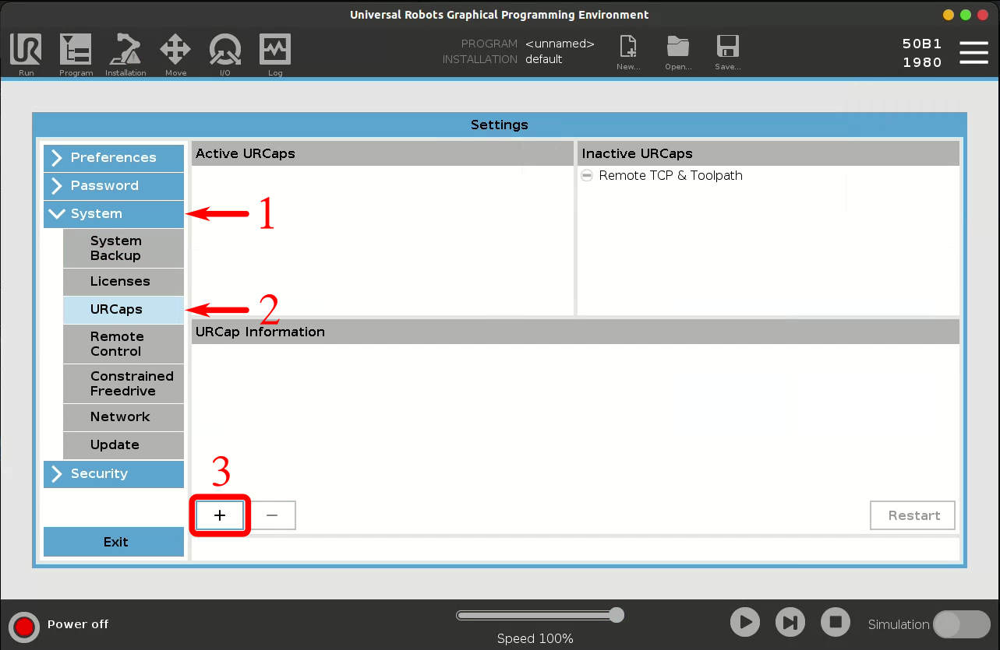

Load the urcap file:

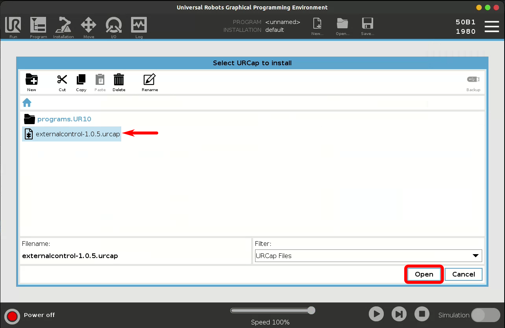

Restart the docker, as asked by polyscope:

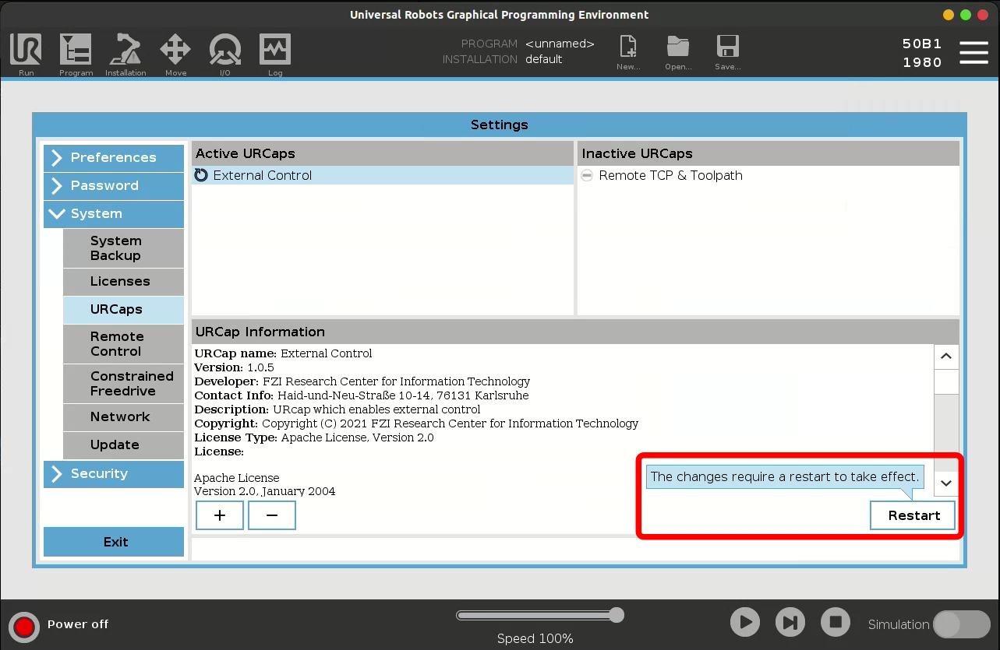

When docker restarted, load the program to control the robot using an external source, ROS in our case:

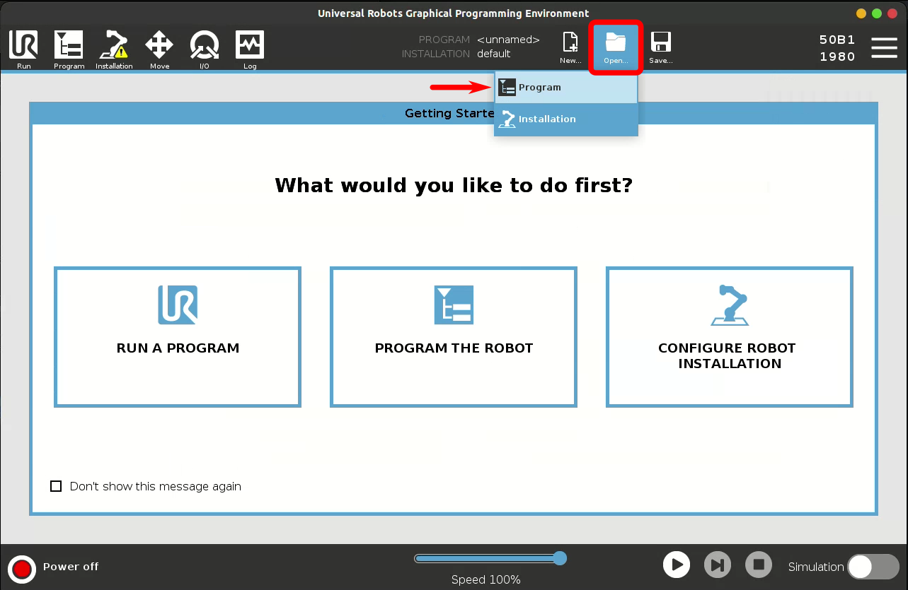

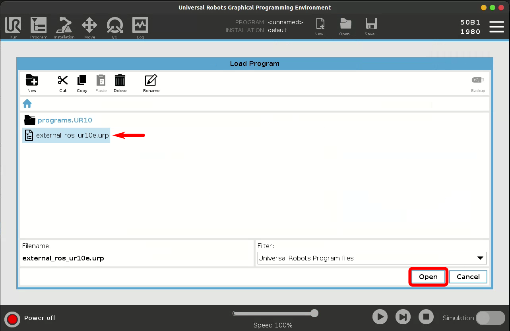

You can verify that everything goes well, under program tab. If the ip address of the robot is 127.0.0.1, *localhost*, then the control is good to go:

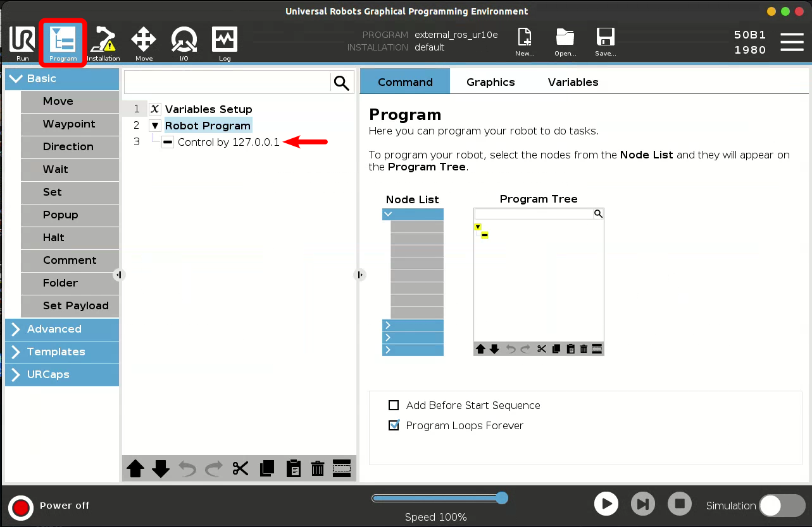

Now activate the robot, clicking on *power off* on the bottom left.

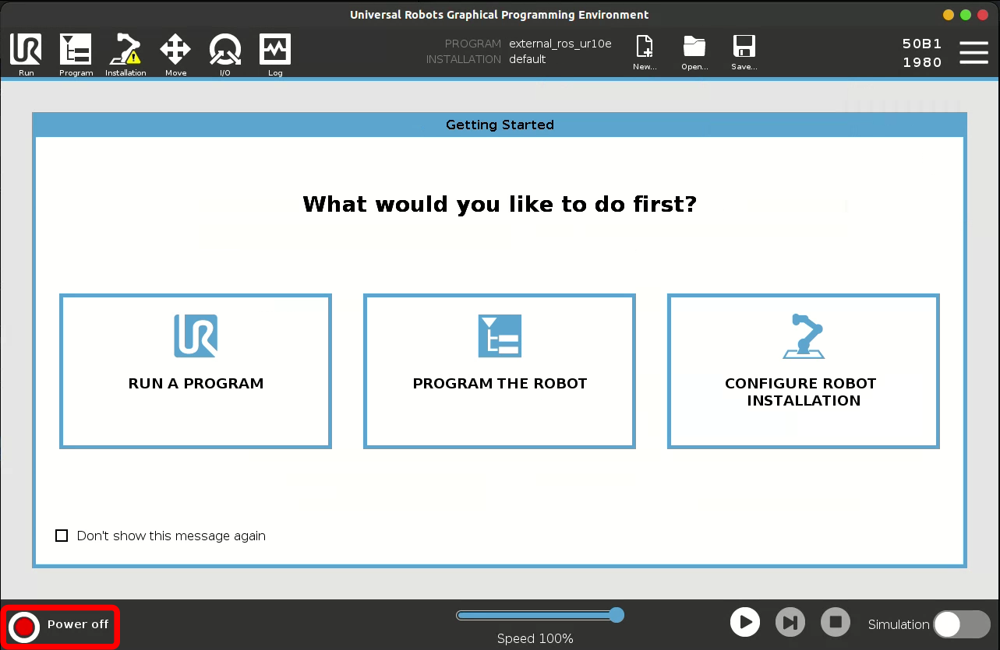

Then press the *ON* button.

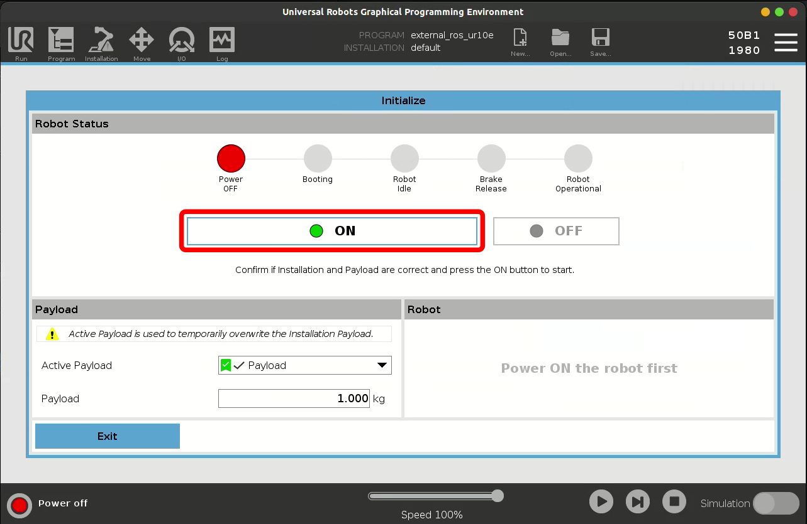

Finally press *START* button, then you can exit this page, pressing *Exit* button on the bottom left.

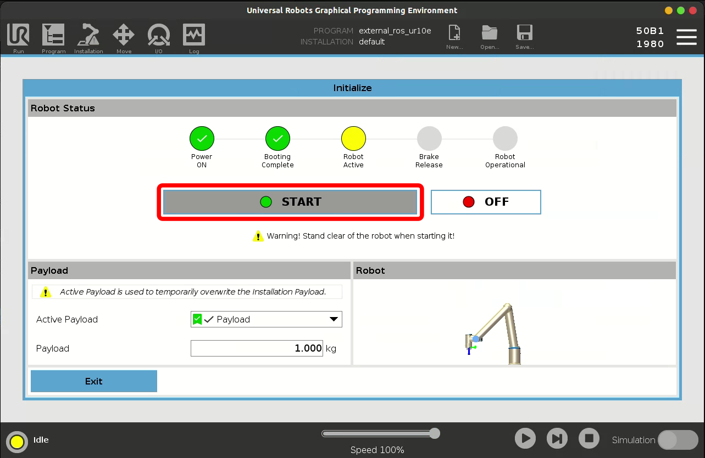

At this step, everything is ready on the UR simulation side. As soon as the planner is started and ready to connect to the robot you can play the program, pressing play button on the bottom right and select *robot program*.

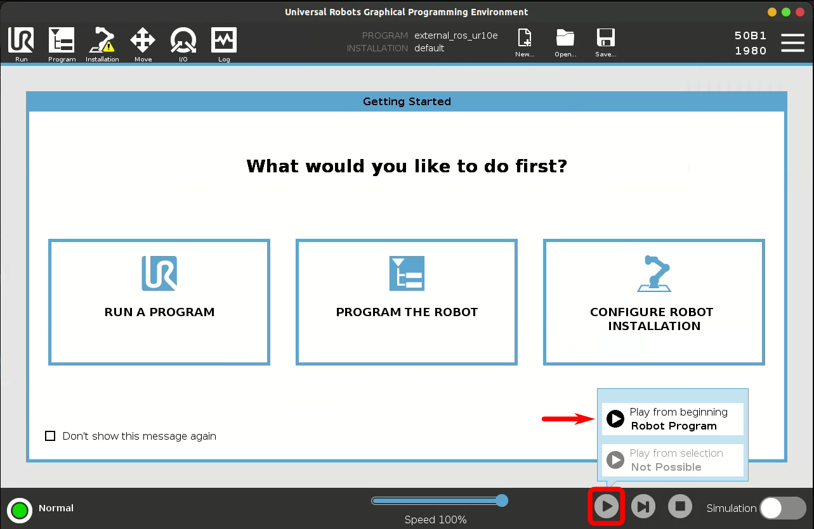

## Maintainers

- Louis Munier - <lmunier@protonmail.com>
- Last Update - 2025-01-26
